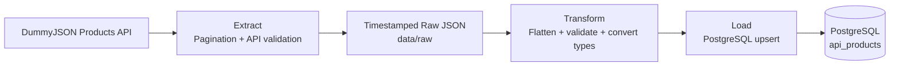

# E-commerce API to PostgreSQL ETL Pipeline

A production-style Python ETL pipeline that extracts paginated product data
from the DummyJSON REST API, validates and transforms nested JSON, and loads
the results into PostgreSQL using idempotent upserts.

The project includes automated testing, structured logging, environment-based
configuration, Docker containerization, Docker Compose orchestration, and
GitHub Actions CI.

---

## 📌 Project Snapshot

| Area | Implementation |
|---|---|
| Data Source | DummyJSON Products REST API |
| Extraction | Paginated API requests with timestamped raw JSON preservation |
| Transformation | Schema validation, nested JSON flattening, type conversion, and derived review metrics |
| Load | PostgreSQL with primary-key validation and idempotent `ON CONFLICT` upserts |
| Reliability | Structured logging, configuration validation, and custom error handling |
| Testing | 15 automated pytest cases |
| Deployment | Docker and Docker Compose |
| CI | GitHub Actions |

---
## Tech Stack

- Python
- pandas
- Requests
- PostgreSQL
- Psycopg
- pytest
- Docker
- Docker Compose
- GitHub Actions


## 🏗️ Pipeline Architecture




The pipeline connects to the PostgreSQL container using the Compose service
hostname `db` rather than `localhost`.

## ⚙️ How the Pipeline Works

### 1. Extract
The pipeline calls the DummyJSON Products API using offset pagination with `limit` and `skip`.

Each page is validated and logged, then combined into a complete product dataset. The original API data is preserved as a timestamped JSON file in `data/raw/` for traceability.

### 2. Transform
The raw JSON is validated before processing.

Nested fields such as dimensions and metadata are flattened into tabular columns, while reviews, tags, and images are summarized into derived metrics. Data types are standardized with pandas nullable types, and invalid required values raise a custom `DataValidationError`.

### 3. Load
The transformed DataFrame is loaded into PostgreSQL using Psycopg.

Products are keyed by their source product ID. PostgreSQL `ON CONFLICT ... DO UPDATE` logic inserts new records and updates existing ones, allowing the pipeline to be rerun without creating duplicate product IDs.

### 4. Orchestrate
The full ETL workflow runs with:

```bash
python -m src.pipeline
```
The orchestrator runs Extract → Transform → Load in sequence, logs each stage, returns exit code `0` on success, and returns a non-zero exit code if the pipeline fails.

---
## ✨ Key Features

- Paginated REST API extraction using `limit` and `skip`
- Timestamped raw JSON preservation for traceability
- Nested JSON normalization and derived metrics with pandas
- Data validation with custom extraction, configuration, transformation, and load errors
- PostgreSQL `ON CONFLICT` upserts for idempotent reruns
- Structured logging to both the terminal and `logs/pipeline.log`
- Environment-based configuration with `python-dotenv`
- Automated pytest coverage for transformation and configuration logic
- Dockerized Python application with PostgreSQL orchestration through Docker Compose
- Database health checks and persistent PostgreSQL storage
- GitHub Actions CI for automated test execution

---

## 🧪 Testing & Continuous Integration

The project includes **15 pytest test cases** covering transformation and configuration logic, including:

- raw JSON transformation and nested-field flattening
- derived review, tag, and image metrics
- missing or invalid product structures
- negative price validation
- required environment variables and integer settings
- placeholder database credential rejection

Run the test suite locally with:

```bash
python -m pytest -v


## What I'd Improve Next

With more time, I would extend the project in the following areas:

- Add unit tests for the extraction and load stages using mocks so API and
  database failures can be tested without external dependencies.
- Add integration tests that run against a temporary PostgreSQL container.
- Introduce retry logic with exponential backoff for temporary API failures
  and rate limiting.
- Support cursor-based pagination in addition to offset pagination.
- Track pipeline runs in a dedicated audit table with start time, end time,
  status, record counts, and failure details.
- Separate raw, staging, and analytical database layers as the dataset grows.
- Add schema migrations instead of creating database tables directly from
  application code.
- Add linting and formatting checks to the CI workflow.
- Add scheduled execution using an orchestrator or cloud scheduler.
- Add monitoring and alerting for failed production pipeline runs.
